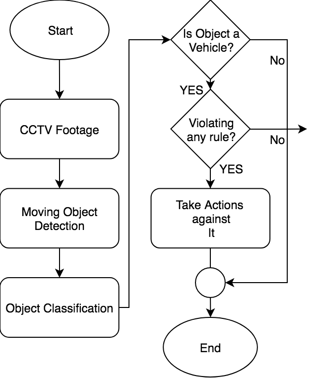
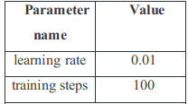
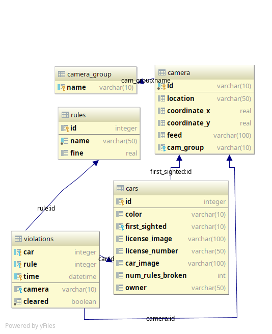
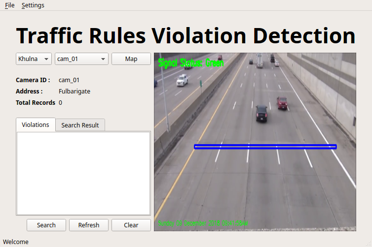
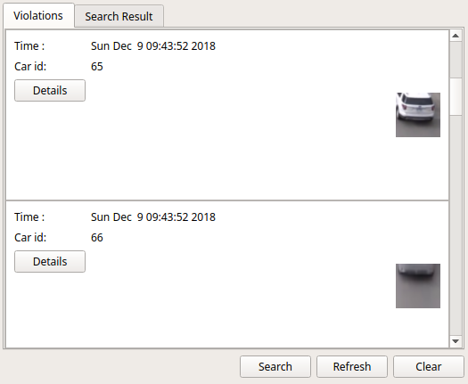
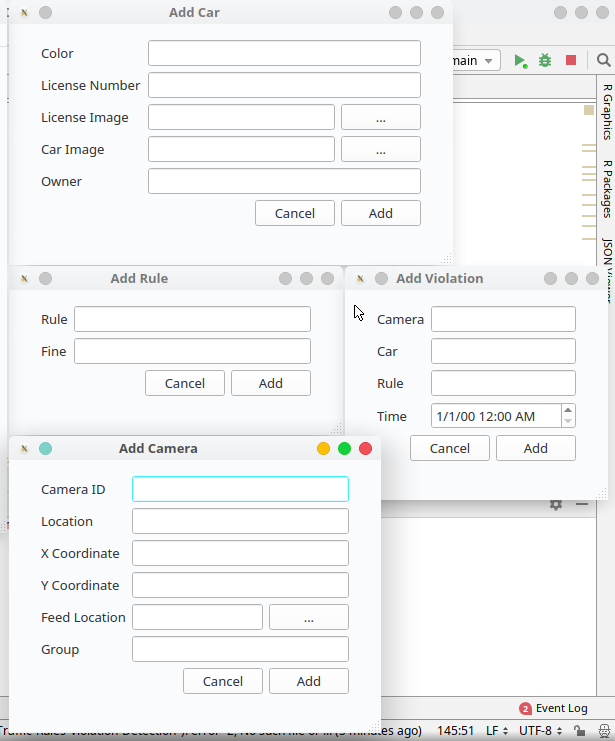
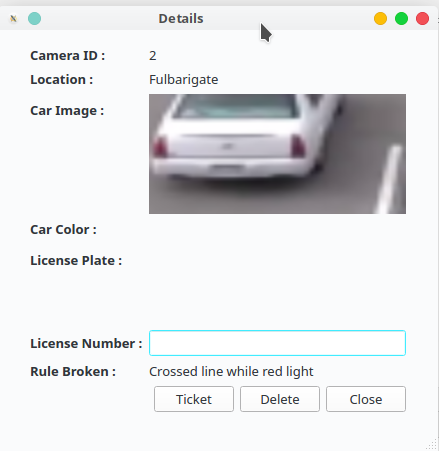
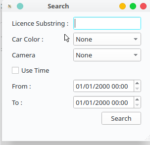
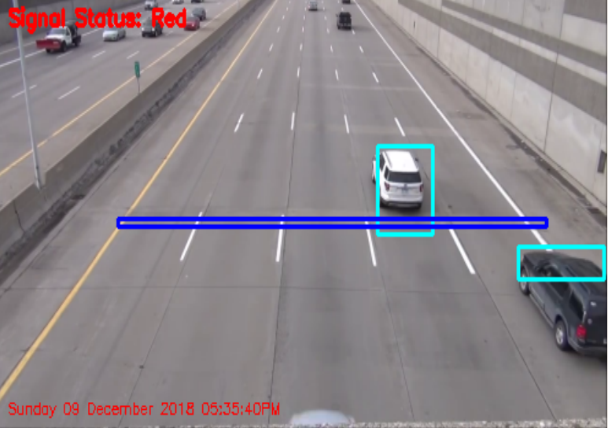
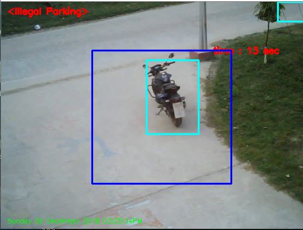

## Introduction

The rising number of vehicles in Indian cities has led to increased traffic congestion, making traffic violations a pressing issue not only in India but also globally. Such violations often result in significant property damage and accidents, putting people's lives at risk. To address this critical problem and prevent these dire consequences, there is a growing need for traffic violation detection systems. These systems help enforce traffic regulations consistently and identify violators effectively.

A real-time traffic violation detection system is essential, enabling authorities to monitor roads continuously. This ensures that traffic enforcers can implement road safety measures with greater accuracy and efficiency, as the system can detect violations faster than human observation. Specifically, the system can identify traffic light violations in real time. To make the system user-friendly, it includes a graphical interface, allowing users to operate the system easily, monitor traffic, and take appropriate actions against rule violations.

## Objective

The goal of the project is to automate the traffic signal violation detection system and make it easy for the traffic police department to monitor the traffic and take action against the violated vehicle owner in a fast and efficient way. Detecting and tracking the vehicle and their activities accurately is the main priority of the system. 

## System Overview

The System consists of two main components -

* Vehicle detection model and
* A graphical user interface (GUI)

First the CCTV camera footage from the road side is sent to the system. Vehicles are detected from the footage. Tracking the activity of vehicles system determines if their is any any violation or not. Different types of violations have different algorithms to determine the violation. A system flowchart 1 shows how the system works.
The Graphical User Interface (GUI) makes the system interactive for user to use. User can monitor the traffic footage and get the alert of violation with the captured vehicle image. User can take further action using the GUI.

## Methodology

### Image Processing

1. ** Grayscaling and blurring **
   As the part of preprocessing the input frame got from the CCTV footage, the image is grayscaled and blurred with Gaussian Blur method.

2. ** Background Subtraction **
   Background subtraction method is used to subtract the current frame from the reference frame to get the desired object’s area. equation (1) shows the method.
   `dst(I) = saturate(|scr1(I) − scr2(I)|)`

3. ** Binary Threshold **
   Binarization method is used to remove all the holes and noises from the frame and get the desired object area accurately. equation (2) shows how the binary threshold works.
   `dst(x, y) = maxVal if scr(x, y) > thresh else 0`

4. ** Dilation and find the contour **
   After getting the thresholded image, it is dilated to fill the holes and the contour is found from the image. drawing rectangle box over the contours desired moving objects are taken.

### Vehicle Classification

From the preprocessed image moving objects are extracted. A vehicle classification model is used to classify those moving objects into three class - Car, Motobike and Non-vehicle. The classifier model is built with mobilenet v1 neural network architecture.

Fig: MobileNet Body Architecture.

Fig-2: Trainning hyperparameters.

Transfer learning approach is used to training the model with our dataset.The dataset consists of 500  images per class. The training parameters are mentioned in table (2).

### Violation detection

After detecting the vehicles three violation cases arises-

* Signal violation: if a vehicle crosses a predefined line on the road while there is red signal, it is detected as a signal violation.
* Parking violation: if a vehicle stands still in no parking zone for a predefined time, it is detected as a parking violation.
* Direction violation: when a vehicle comes from a wrong direction,it is detected by tracking the vehicle. The direction of the vehicle is determined using its current position and previous few positions.

### Database Structure

We have used SQLite database with python to manage the whole data of our application. Here, in the relational database we have used BCNF of 5 tables. The tables are:

1. Cars
2. Rules
3. Cameras
4. Violations
5. Groups

** Here are the descriptions of each tables: **

##### Cars:

This table will hold the recorded cars by the camera. A car entity is a car with a unique identifier(id), color(color), license-number of the car(license), where the car is first sighted (first_sighted), an image of the license number (license_image), an image of the car(car_image), number of rules broken so far(num_rules_broken) and the owner of the car (owner).

##### Rules:

This table holds all the rules, their description(name) and fine for breaking that rule (fine).

##### Camera:

Camera table holds a unique identifier for the camera(id), location description(location), the longitude(coordinate_x) and the latitude(coordinate_y) of the location of the camera, where the camera will feed its data video(feed) and in which group the camera is in(group).

##### Camera_group:

This table simply holds the unique group names of the camera groups(name). Violations: This table takes all the ids of other tables as foreign key and creates a semantic record like this: A car with this id has broken that rule at this time, which is captured by this camera.

## Implementation

### Image Processing and Computer Vision

OpenCV computer vision library is used in  Python for image processing purpose. For implementing the vehicle classifier with ,  Tensorflow machine learning framework is used.

### Graphical User Interface (GUI)

The user interface has all the options needed for the administration and other debugging purpose so that, we do not need to edit code for any management. For example, if we need to add some sample cars or camera in the database, we can do it with the menu item (see fig-3).

Figure 2: Overall user interface view

Primarily, for the start of the project usage, the administrator needs to add a camera with the menu item. In the way, the administrator can add the location of the camera, the feed file for the camera. Here the feed file is installed by the camera module over the internet. We have used Linux file sharing pattern for getting the video from the camera, where the camera will feed the given file to the server, and the server will take the feed file to process and detect violation. Also the X and Y coordinate(fig-3) of the camera location can be saved by the admin. This is done for future use, when we will try to use a map for locating the cameras with ease. Also the admin need to specify some rules with a JSON file for the camera. For example, the camera is used for cross road on red line violation, or is used for wrong place parking detection etc.

Figure 3: Interface for adding camera entity

Actually, this is all mainly needed for starting up the system. After adding the camera, the software will automatically start detecting violations of traffic rules. After this, opening the camera by selecting it with the drop down menu, will fill the detection rules violations(fig-4).

Figure 4: List view of violation records

The user has many other objects to insert into the database. The admin can add the following entities in the graphical user interface:

1. Camera (fig-3)
2. Car (fig-5)
3. Rule (fig-5)
4. Violation (fig-5)

Figure 5: Adding items interface

The GUI is made mainly for this purpose that, there will always be a supervisor for a group of cameras. He can see the list of rule violations and can see details of the cars that violated the rules (fig-8). If he clicks on the detail button, a new window will appear where the user will be able to file the report or send/print ticket for the car owner.

Figure 8: details of rule violation

Also the admin/user can delete the records if he gets a false positive. But there will never a record deleted. The database has a marker of which file have been archived. If we want to retrieve a record from the deleted once, then the admin needs to go to the archive window. There he can restore any record he wants.
The user can also search for a vehicle, with its license number, its color, or date of a rule violation. The license number has text prediction so the user will be sure while typing a license number that it exists.

Figure  9: Searching a car or rule violation

### Rules violation video representation in UI

There are currently 3 rules we are concerned with.

1. Signal Violation
2. Parking Violation
3. Direction Violation.

For Signal Violation, We have used a straight line in the picture. When the traffic light is red and a car is crossing the straight line, a picture of that car is registered in the database along with some environmental values. The user can see in the live preview which car are being detected real time and tested if they are crossing the line.

Figure  11: Signal violation camera representation

For Parking violation, we have prefigured a rectangle, which is the restricted area for car parking. If there is a vehicle in the rectangle for more than a predefined time, then a image with other environmental values is being registered to the database.

Figure  12: Parking violation camera representation

For direction violation detection, some lines are drawn to divide into regions. Then when a car moves from one region to another, its direction is measured. If the direction is wrong, then it is registered as previous.

Figure  13: Direction violation camera representation

Libraries used for graphical user interface:

1. PyQt5
2. QDarkStyle
3. PyQtTimer